# DMVPN-PHASE3-IPSEC-IKEv2

> **Autor:** Randy Nin **| Laboratorio de Redes | GNS3**

Implementación completa de DMVPN Phase 3 con IPSec IKEv2 en una topología hub-and-spoke de tres sites sobre Cisco IOS. A diferencia de Phase 2, el shortcut spoke-to-spoke se logra mediante un mecanismo explícito de NHRP redirect (Hub) y NHRP shortcut (Spokes), sobre una red OSPF point-to-multipoint que separa completamente el plano de control del plano de datos. Esta es la arquitectura DMVPN recomendada por Cisco para despliegues de producción a gran escala.

---

## Contenido del repositorio

```
DMVPN-PHASE3-IPSEC-IKEv2/
├── images/
│   ├── topology.png
│   ├── before-vpn-ping.png
│   ├── after-vpn-ping.png
│   ├── wireshark-ikev2-spokea-hub.png
│   ├── wireshark-ikev2-spokec-hub.png
│   ├── wireshark-esp-multidireccional.png
│   ├── wireshark-esp-detail.png
│   ├── sitea-dmvpn.png
│   ├── hub-dmvpn.png
│   ├── sitec-dmvpn.png
│   ├── sitea-nhrp.png
│   ├── hub-nhrp.png
│   ├── sitec-nhrp.png
│   ├── sitea-ikev2-ipsec-sa.png
│   ├── hub-ikev2-ipsec-sa.png
│   ├── sitec-ikev2-ipsec-sa.png
│   ├── sitea-ospf.png
│   ├── hub-ospf.png
│   └── sitec-ospf.png
├── DMVPN-F3-IKEv2
├── Documentación Tecnica Profesional VPN - DMVPN Fase 3 - IPSec IKEv2 (Randy Nin -- 2025-0660).pdf
└── README.md
```

---

## Documentación técnica

**[Documentación Tecnica Profesional VPN - DMVPN Fase 3 - IPSec IKEv2 (Randy Nin -- 2025-0660).pdf](Documentación%20Tecnica%20Profesional%20VPN%20-%20DMVPN%20Fase%203%20-%20IPSec%20IKEv2%20(Randy%20Nin%20--%202025-0660).pdf)**

---

## Topología

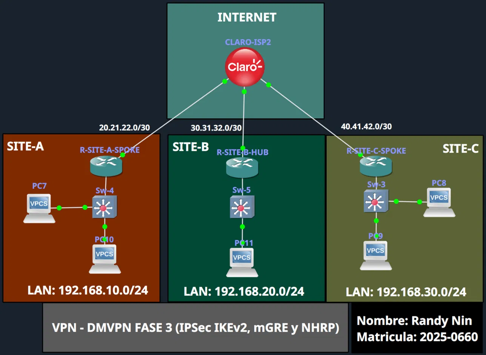

|Dispositivo|Rol|WAN IP|Tunnel IP|LAN|
|:--|:--|:--|:--|:--|
|R-SITE-B-HUB|Hub (NHS)|30.31.32.1|172.16.0.1|192.168.20.0/24|
|R-SITE-A-SPOKE|Spoke|20.21.22.1|172.16.0.2|192.168.10.0/24|
|R-SITE-C-SPOKE|Spoke|40.41.42.1|172.16.0.3|192.168.30.0/24|

---

## Diferencia clave vs Phase 2

|Aspecto|Phase 2 (IKEv1)|Phase 3 (este lab, IKEv2)|
|:--|:--|:--|
|Shortcut spoke-to-spoke|Implícito (OSPF broadcast ya calcula el next-hop)|Explícito: `ip nhrp redirect` + `ip nhrp shortcut`|
|Tipo de red OSPF|`broadcast`, Hub forzado como DR|`point-to-multipoint`, sin DR|
|Adyacencias OSPF de un Spoke|Solo con el Hub|Solo con el Hub (siempre, sin excepción)|
|`show ip route ospf` para LAN remota|Ya muestra el spoke directamente|Siempre muestra el Hub, con símbolo `%` de override|
|Entradas NHRP|Solo tunnel IPs|Tunnel IPs + subredes LAN completas (`rib nho`)|
|Compatible con resumen de rutas en el Hub|Limitado|Diseñado para esto|

---

## Configuración clave

Archivo completo: [`DMVPN-F3-IKEv2`](./DMVPN-F3-IKEv2)

**IKEv2 con PSK wildcard (idéntico en Hub y ambos Spokes):**

```
crypto ikev2 proposal IKEv2_PROP
 encryption aes-cbc-256
 integrity sha256
 group 14

crypto ikev2 keyring IKEv2_KEYRING
 peer ANY
  address 0.0.0.0 0.0.0.0
  pre-shared-key randy123

crypto ikev2 profile IKEv2_PROF
 match identity remote address 0.0.0.0
 authentication remote pre-share
 authentication local pre-share
 keyring local IKEv2_KEYRING
 lifetime 86400

crypto ipsec transform-set TRANF_SET esp-aes 256 esp-sha256-hmac
 mode transport

crypto ipsec profile IKEv2_VTI_PROF
 set transform-set TRANF_SET
 set ikev2-profile IKEv2_PROF
 set pfs group14
```

**Hub (con `ip nhrp redirect`):**

```
interface Tunnel0
 ip address 172.16.0.1 255.255.255.0
 tunnel source GigabitEthernet0/2
 tunnel mode gre multipoint
 ip nhrp network-id 1
 ip nhrp authentication randy321
 ip nhrp map multicast dynamic
 ip nhrp redirect
 ip ospf network point-to-multipoint
 tunnel protection ipsec profile IKEv2_VTI_PROF
```

**Spoke (con `ip nhrp shortcut`, ejemplo SITE-A):**

```
interface Tunnel0
 ip address 172.16.0.2 255.255.255.0
 tunnel source GigabitEthernet0/1
 tunnel mode gre multipoint
 ip nhrp network-id 1
 ip nhrp authentication randy321
 ip nhrp nhs 172.16.0.1
 ip nhrp map 172.16.0.1 30.31.32.1
 ip nhrp map multicast 30.31.32.1
 ip nhrp shortcut
 ip ospf network point-to-multipoint
 tunnel protection ipsec profile IKEv2_VTI_PROF
```

---

## Antes de la VPN: sin conectividad

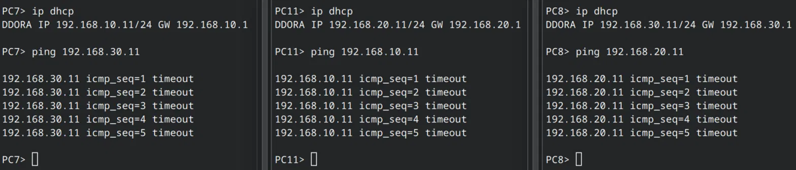

---

## Negociación IKEv2

Cada spoke negocia independientemente con el Hub en 4 mensajes.

**Spoke-A <-> Hub:**

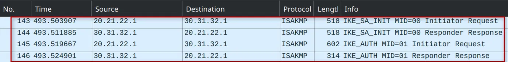

**Spoke-C <-> Hub:**

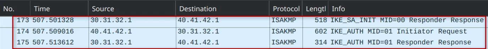

---

## Tráfico ESP entre los tres pares

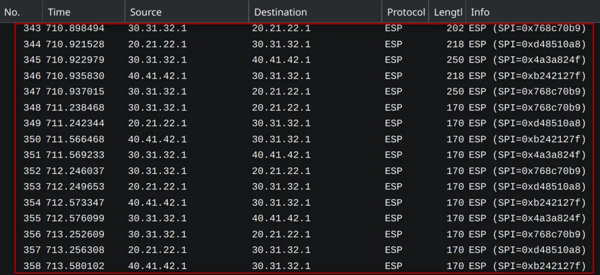

---

## Conectividad establecida

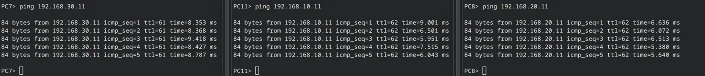

---

## Verificación

### show dmvpn

Los spokes muestran el flag `T2` (Nexthop-override) en el peer remoto, exclusivo de Phase 3.

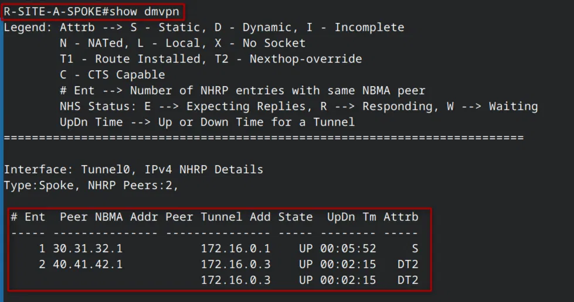

### show ip nhrp

Las subredes LAN completas de los spokes remotos aparecen resueltas directamente, con flag `rib nho`.

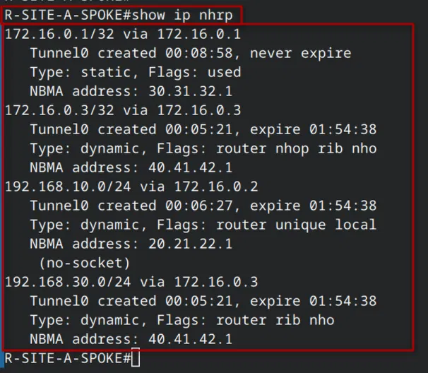

### show crypto ikev2 sa / show crypto ipsec sa

Dos IKE SAs por spoke: una hacia el Hub, otra directa hacia el spoke remoto.

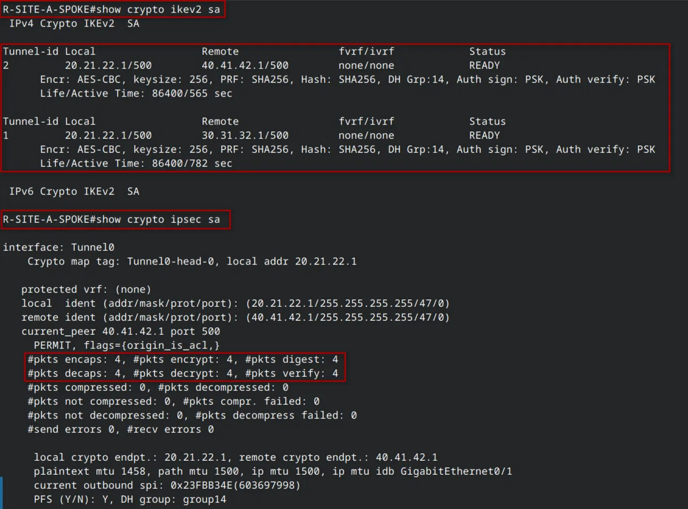

### show ip ospf neighbor / show ip route ospf

Un único vecino OSPF (el Hub) en estado `FULL/ -`. Las rutas hacia el otro spoke muestran el símbolo `%` de override.

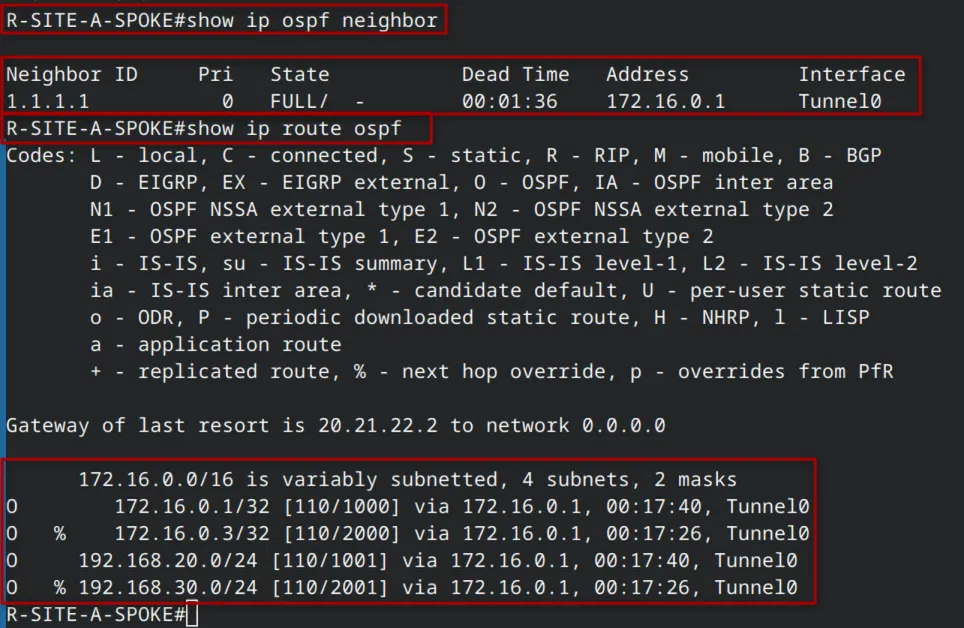 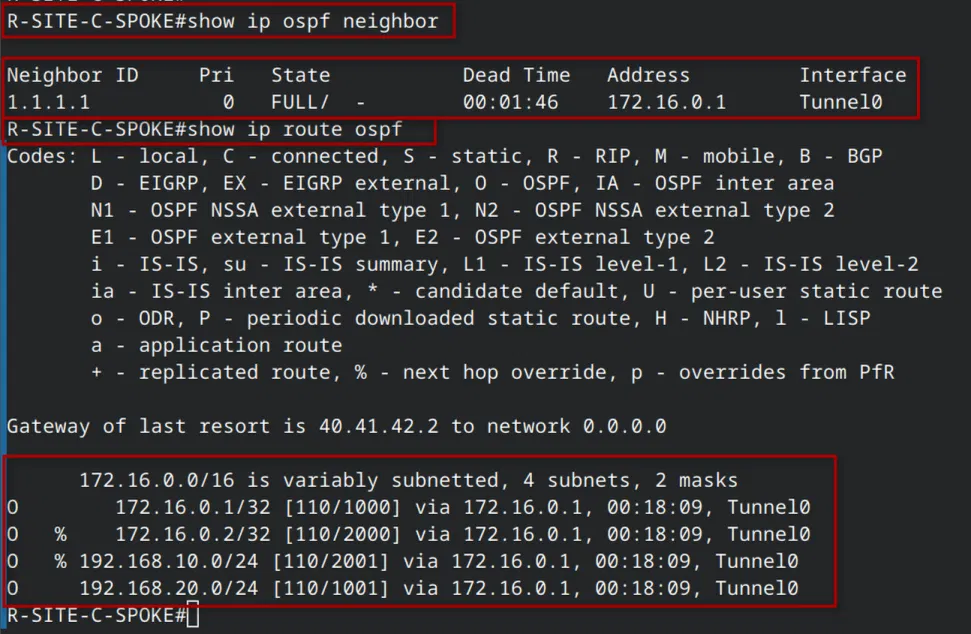

---

## Tabla comparativa: los 8 métodos Site-to-Site documentados

|Método|IKE|Msgs|Tunnel|OSPF type|Shortcut|
|:--|:-:|:-:|:--|:--|:-:|
|PB IKEv1|v1|9|No|N/A|N/A|
|RB IKEv1|v1|9|VTI|N/A|N/A|
|GRE IKEv1|v1|9|GRE|N/A|N/A|
|PB IKEv2|v2|4|No|N/A|N/A|
|RB IKEv2|v2|4|VTI|N/A|N/A|
|GRE IKEv2|v2|4|GRE|N/A|N/A|
|DMVPN Phase 2|v1|9|mGRE|broadcast|Implícito|
|**DMVPN Phase 3**|**v2**|**4**|**mGRE**|**point-to-multipoint**|**Explícito**|

---

## Video demostrativo

https://youtu.be/dXiO8xkj3B0

---

_Randy Nin / Matrícula 2025-0660_

---

